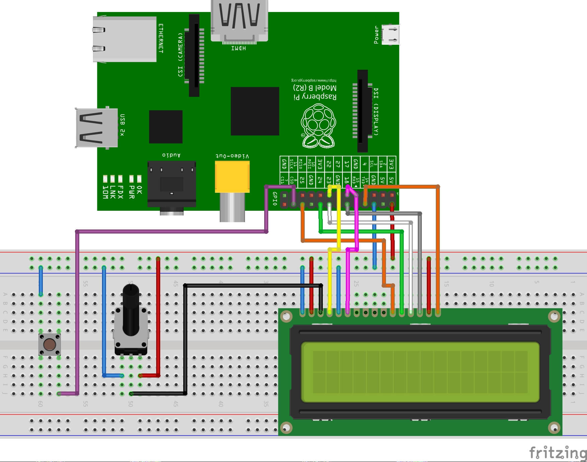
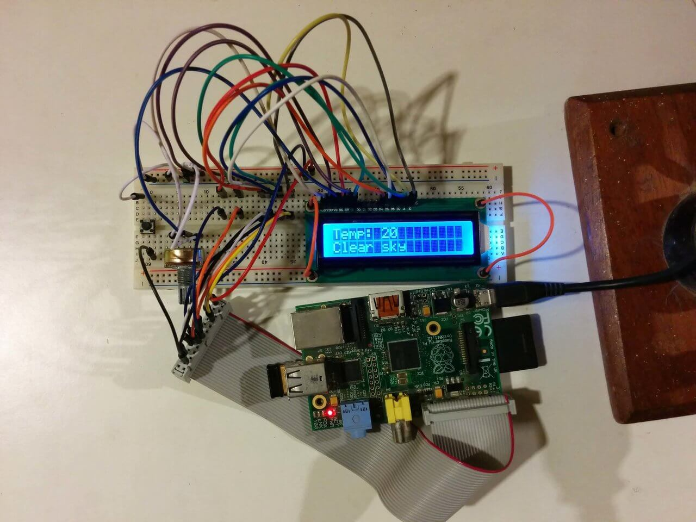

# Pi LCD Weather

This project uses a Raspberry Pi to show the current weather pulled from 
[OpenWeatherMap](http://www.openweathermap.com/) on an 16x2 LCD

#### Layout
The Fritzing file can be found in the images folder 

#### Final result

#### Setup
The software part of this project can be configured by running the `setup.sh` script file 
    
    source setup.sh
    
It installs the `virtualenv` package, if its missing, creates a virtual environment 
and install the dependencies listed in `requirements.txt`. 

A systemd unit file is copied to `/etc/systemd/system/pi-lcd-weather.service`, 
which points to the current project location, it then gets enabled to start on boot
and is then started. 

The `config.ini` file contains the OpenWeatherMap API key, a city ID 
and the temperature measure unit. The API key can be obtained 
[here](http://www.openweathermap.com/api). The city ID can be extracted from the url
after searching and selecting a city [here](http://www.openweathermap.com/city). 
Possible values for temperature measure units are `metric` (for Celsius) and 
`imperial` (for Fahrenheit)
The `config.ini` file is created if its missing.

If the setup was done with `setup.sh`, the program can be started with
 
    sudo systemctl start pi-lcd-weather.service
    
or restarted after a change with

    sudo systemctl restart pi-lcd-weather.service

It can also be started by activating the virtual environment first and then executed with
    
    source venv/bin/activate
    python lcd.py

Errors are logged into `lcd.log`

#### Sources: 
- [Adafruit's Legacy Raspberry Pi Python Code Library](https://github.com/adafruit/AdaFruit-Raspberry-Pi-Python-Code) 
- [Adafruit Python CharLCD](https://github.com/adafruit/Adafruit_Python_CharLCD)
- [How to use interrupts with Python on the Raspberry Pi and RPi.GPIO](http://raspi.tv/2013/how-to-use-interrupts-with-python-on-the-raspberry-pi-and-rpi-gpio)
